# Billing App Application Flow Design

This document explains the Billing App backend flow using diagrams and short notes. It is intended for developers, testers, and new team members who need to understand how requests move through the system and how the main business scenarios connect.

## System Context

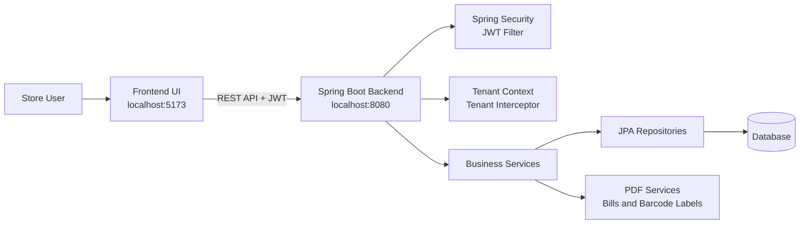

The frontend calls the backend REST APIs. After login, the backend returns a JWT token. Protected requests use the JWT to identify the user, role, and tenant.

## Main Backend Layers

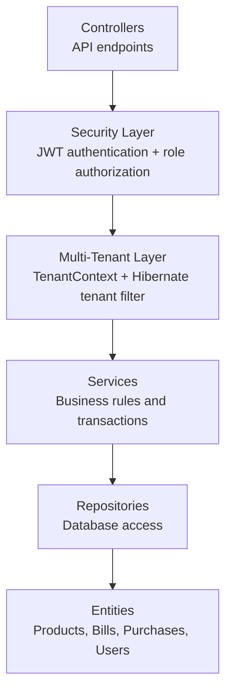

## Authentication And Tenant Flow

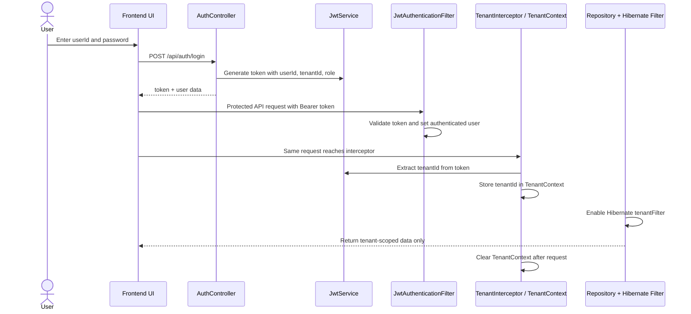

## Role-Based Access

```mermaid
flowchart LR
    Login[Public<br/>/api/auth/login]
    ProvisionOwner[Operator key<br/>/api/provisioning/tenants/{tenantId}/owner]
    AddUser[Admin only<br/>/api/users/adduser]
    Cashier[Role: CASHIER]
    Admin[Role: ADMIN]

    Cashier --> Bills[/api/bills/**]
    Cashier --> Products[/api/products/**]
    Cashier --> SalesmanList[/api/salesman]
    Cashier --> Dashboard[/api/dashboard/**]

    Admin --> Bills
    Admin --> Products
    Admin --> SalesmanList
    Admin --> Dashboard
    Admin --> AddSalesman[/api/salesman/addsalesman]
    Admin --> Reports[/api/reports/**]

    Login -.-> Cashier
    Login -.-> Admin
    ProvisionOwner -.-> Admin
    Admin --> AddUser
```

The application operator provisions the first tenant admin through Swagger using the `X-Provisioning-Key` header. Set a high-entropy `APP_PROVISIONING_KEY` of at least 32 characters in the backend environment before provisioning; if it is missing or too short, the provisioning endpoint is disabled. Provisioning creates an `ADMIN` user and refuses a tenant that already has a user. The Swagger operation is `POST /api/provisioning/tenants/{tenantId}/owner` with a body such as `{"userId":"owner@example.com","password":"replace-with-a-long-unique-password","name":"Store Owner"}`. After that, an authenticated tenant admin can create `CASHIER` and `MANAGER` users. The server takes the tenant ID from the signed-in admin's JWT and does not accept a tenant ID or admin role from the staff creation request.

Password changes require the authenticated user's current password and new password. The target user is always taken from the authenticated principal; a caller cannot choose another user ID.

The first-login form asks for the current/temporary password, a new password of at least 12 characters, and confirmation. It sends `POST /api/auth/change-password` with the login bearer token and JSON containing `currentPassword` and `newPassword`. After a successful update it clears the local first-login flag and continues the session. An incorrect current password or invalid new password returns a validation error (400) for display in the form; it does not trigger the frontend's 401 logout handler.

Role access is enforced by API area: cashiers can use sales, products (read only), customers, salesman lookup, and dashboard endpoints. Managers can perform operational and inventory tasks and view reports. Tenant admins can manage staff and use all tenant functions. Only the platform operator key can provision a tenant's first admin.

## Master Data Flow

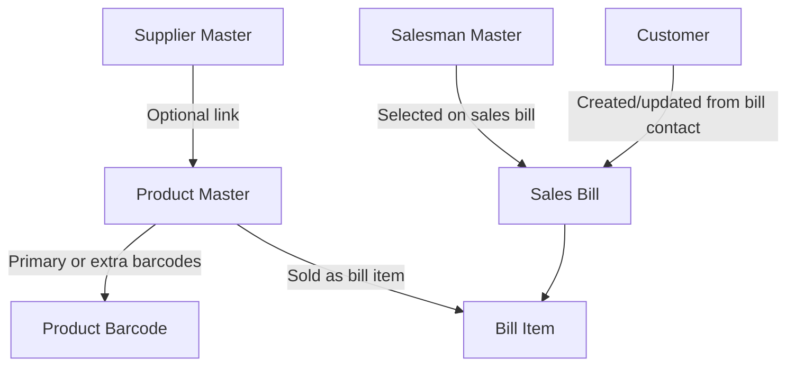

Master data supports transaction flows:

- Suppliers are used for purchase bills and can be linked to products.
- Products carry price, stock, category, GST, HSN, supplier, and barcode information.
- Product barcodes can represent one product scan or a configured quantity per scan.
- Salesmen are attached to sales bills.
- Customers are captured automatically from bill customer/contact details.

## Purchase / Stock Inward Flow

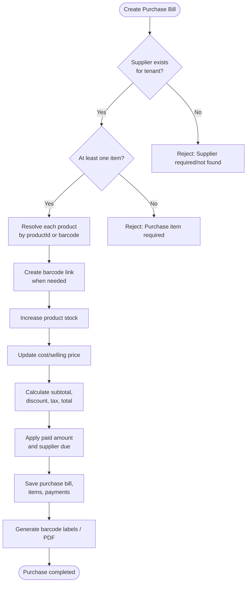

Purchase rules:

- Purchase bill number is required and unique per tenant, supplier, and bill number.
- Quantity must be greater than zero.
- Purchase price must be zero or greater.
- Creating a purchase increases product stock.
- Paid amount cannot exceed purchase total.
- Supplier due is `totalAmount - paidAmount`.
- A purchase cannot be cancelled after supplier payment is recorded.
- Cancelling a purchase reverses stock and marks the purchase as `CANCELLED`.

## Sales Billing Flow

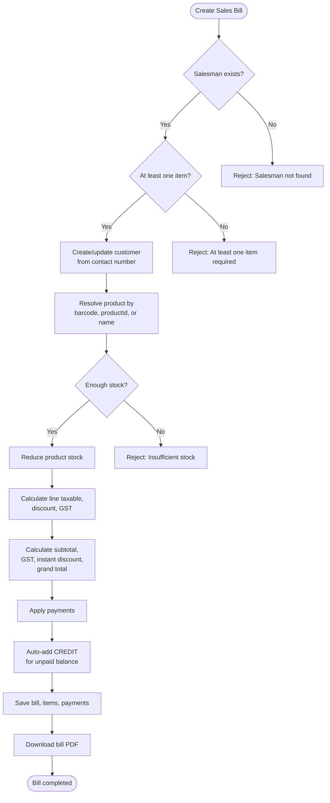

Sales billing rules:

- A bill must have a salesman and at least one item.
- Product can be resolved by barcode, product ID, or product name.
- Barcode must belong to the requested product when both are supplied.
- Stock is reduced during bill creation.
- GST is calculated per item using the product GST rate.
- Instant discount is an absolute amount and cannot exceed the bill total.
- If no payment is sent, the full bill becomes `CREDIT`.
- If partial payment is sent, the remaining amount is auto-recorded as `CREDIT`.
- Sum of payments cannot exceed the bill total.

## Customer Due Collection Flow

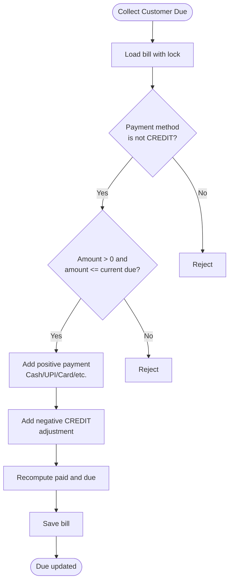

## Supplier Due Payment Flow

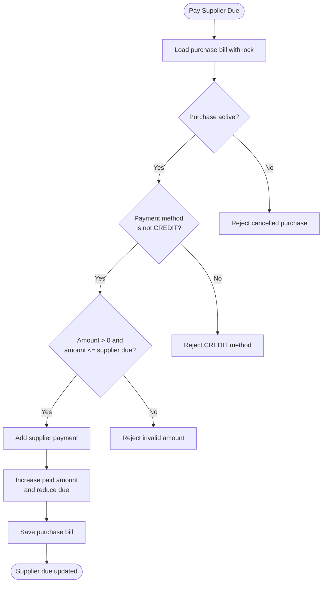

## Reporting And Dashboard Flow

```mermaid
flowchart LR
    UI[Frontend UI] --> Dashboard[/api/dashboard/today]
    UI --> Daily[/api/reports/daily]
    UI --> Monthly[/api/reports/monthly]
    UI --> Range[/api/reports/range]
    UI --> Sales[/api/reports/sales]
    UI --> DayEnd[/api/reports/day-end]
    UI --> Register[/api/bills/register]
    UI --> Summary[/api/bills/register/summary]

    Dashboard --> Bills[(Bills)]
    Dashboard --> Products[(Products)]
    Daily --> Bills
    Monthly --> Bills
    Range --> Bills
    Sales --> Bills
    DayEnd --> Bills
    Register --> Bills
    Summary --> Bills
```

Reports are tenant-scoped and use bill/payment data to calculate totals, payment splits, dues, and date-based summaries.

## Entity Relationship Diagram

This is the main ER diagram for the application. It shows the core tables, primary keys, foreign keys, tenant ownership, and transaction relationships.

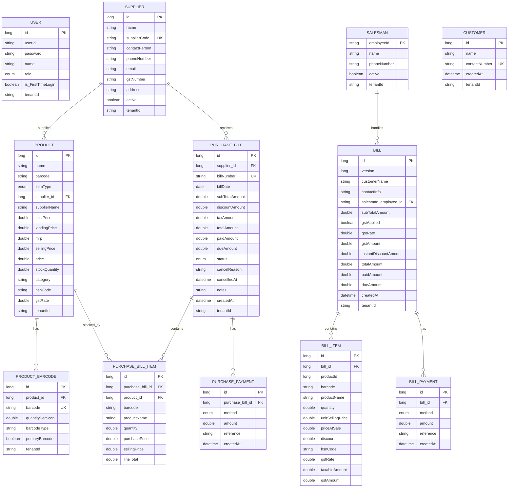

## ER Diagram Notes

- `tenantId` separates data by store/tenant. Tenant-owned tables are filtered using Hibernate `tenantFilter`.
- `USER.tenantId` is embedded into the JWT during login and drives tenant scoping for later requests.
- `SUPPLIER.supplierCode` is unique per tenant.
- `PRODUCT.barcode` is unique per tenant, and extra barcodes are stored in `PRODUCT_BARCODE`.
- `PRODUCT_BARCODE.quantityPerScan` supports cases like carton/barcode scans where one scan maps to multiple product units.
- `BILL_ITEM` stores product name and price details at sale time so old bills do not change when product master data changes later.
- `PURCHASE_BILL_ITEM` links directly to `PRODUCT`; creating a purchase increases product stock.
- `BILL` links to `SALESMAN` through `salesman_employee_id`; creating a sales bill reduces product stock.
- `CUSTOMER` is not directly linked by foreign key to `BILL`; customer records are created or updated from bill contact details.
- `BILL_PAYMENT` and `PURCHASE_PAYMENT` store payment history and due adjustments.

## Simplified Business ER View

Use this smaller version when explaining the application to non-technical users.

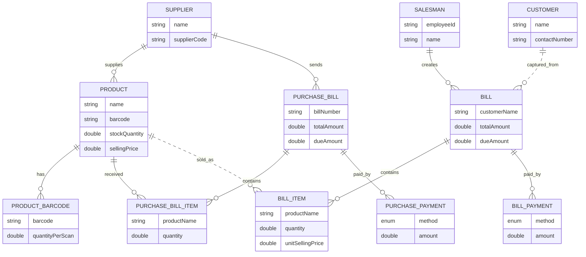

## API Map

```mermaid
flowchart TB
    Auth[Authentication<br/>/api/auth]
    Users[Users<br/>/api/users]
    Products[Products<br/>/api/products]
    Suppliers[Suppliers<br/>/api/suppliers]
    Salesman[Salesmen<br/>/api/salesman]
    Bills[Sales Bills<br/>/api/bills]
    Purchases[Purchases<br/>/api/purchases]
    Reports[Reports<br/>/api/reports]
    Dashboard[Dashboard<br/>/api/dashboard]

    Auth --> Login[POST /login]
    Auth --> ChangePassword[POST /change-password]
    Users --> AddUser[POST /adduser]
    Products --> ProductOps[Create, list, search,<br/>barcode lookup, barcode links]
    Suppliers --> SupplierOps[Create, list, search,<br/>update, active status]
    Salesman --> SalesmanOps[Create, list,<br/>active status]
    Bills --> BillOps[Create, list, register,<br/>summary, payment, PDF]
    Purchases --> PurchaseOps[Create, list, get,<br/>cancel, payment, labels, PDF]
    Reports --> ReportOps[Daily, monthly, range,<br/>sales, day-end]
    Dashboard --> Today[Today summary]
```

## End-To-End Business Flow

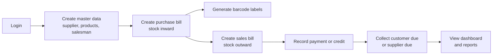

## Important Invariants

- Every tenant-owned entity is scoped using `tenantId`.
- `TenantInterceptor` extracts tenant information from the JWT and stores it in `TenantContext`.
- `TenantFilterAspect` enables the Hibernate `tenantFilter` before repository calls.
- Purchase transactions increase inventory stock.
- Sales bill transactions reduce inventory stock.
- Customer credit is represented through `CREDIT` bill payments.
- Customer due collection adds a positive payment and a negative `CREDIT` adjustment.
- Supplier purchase due cannot be paid using `CREDIT`.
- Reports and dashboards are calculated from tenant-scoped bill and payment data.
