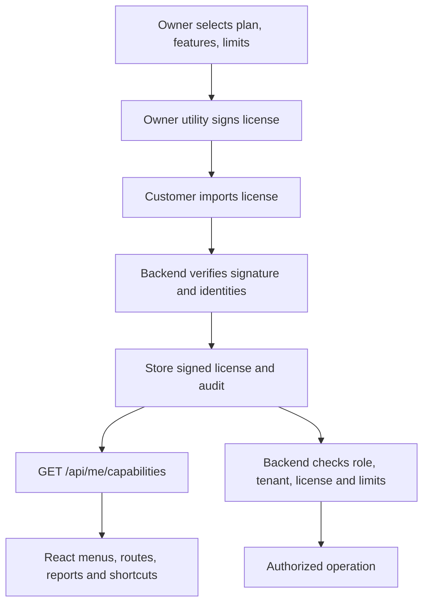

# Plans, offline licensing, and module access

Implemented 9 October 2026. This guide describes the implementation, setup steps, operating policies, and limits.

## 1. Scope

There are two applications:

1. **Pahal Retail**, the customer billing backend and React UI. It verifies licenses and enforces modules and limits.
2. **Pahal License Manager**, a separate Java Swing desktop utility for the application owner. It generates signing keys and customer licenses. Its source set is excluded from customer boot JARs.

The owner utility requires Java 17 or newer on the owner's laptop. Customers continue to use the existing packaged runtime when a new customer EXE is explicitly built. This change does not rebuild that EXE.

No licensing cloud, payment gateway, recurring charge collection, telemetry upload, or internet connection is required. Annual licenses and seven days of grace are the accepted defaults. Payment collection and commercial prices are managed separately by the owner.

The dashboard's visual redesign is a separate next task. Existing dashboard shortcuts and supplier dues now follow the capability model.

## 2. Packages and defaults

| Plan code | Included modules | Suggested active users | Suggested registered counters |
| --- | --- | ---: | ---: |
| BASIC | Billing, products/basic stock, customer dues, sales returns, basic reports, invoice tax configuration, essential cashier shifts | 2 | 1 |
| PLUS | Basic plus purchases/suppliers/purchase returns, supplier statements, stock adjustments, opening-stock import, cross-cashier reconciliation | 5 | 2 |
| PRO | Plus plus profit reports, advanced product/stock reports, GST accounting workspace | 10 | 5 |
| PLUS_PRO | All current modules with higher suggested limits and owner-selected customization | 25 | 10 |

Limits are suggestions prefilled by the owner utility. The owner can change them before signing. The administrator counts as an active user. There is no bill-count, product-count, or customer-count limit in this release.

Plus Pro has the same current feature set as Pro; its initial difference is suggested capacity and custom packaging. It does not imply that multi-store operations or LAN hosting have been implemented.

Owner selections can add features to a lower package or remove optional features from a higher package. Runtime access uses the exact signed feature list, rather than deriving grants from the plan's display name. Plan definitions have version 1; future catalog changes should create a new version and retain support for existing contracts.

### Stable feature IDs

`BILLING`, `PRODUCTS`, `CUSTOMER_DUES`, `SALES_RETURNS`, `BASIC_REPORTS`, `PURCHASES`, `SUPPLIER_STATEMENTS`, `STOCK_ADJUSTMENTS`, `OPENING_STOCK_IMPORT`, `CASH_RECONCILIATION`, `PROFIT_REPORTS`, `ADVANCED_REPORTS`, `GST_ACCOUNTING`.

Every license must include the five core feature IDs. `SUPPLIER_STATEMENTS` requires `PURCHASES`; `OPENING_STOCK_IMPORT` requires `STOCK_ADJUSTMENTS`. Advanced financial/report features require billing. Invalid feature combinations are rejected by both issuer and verifier.

Invoice GST calculation, GST product fields, invoice settings and original invoice PDFs remain core. Removing GST Accounting removes its aggregate working reports, HSN analysis, and full workspace; it does not turn off invoice tax calculation. Essential own-shift opening, cash handling, closing, and settlement support remain core; paid reconciliation controls cross-cashier history/report access.

## 3. Owner signing-key setup — once

From the backend folder:

```powershell
Set-Location 'D:\Web Development\Billing_App'
.\gradlew.bat ownerLicenseManager
```

This opens the owner utility without starting Spring or connecting to PostgreSQL.

1. Click **Create signing keys (once)**.
2. Choose and confirm a signing password of at least 12 characters.
3. Click **Export public verification key**.
4. Export the PUBLIC key as:

```text
D:\Web Development\Billing_App\src\main\resources\licensing\owner-public-key.der
```

Create the `licensing` resource directory if it does not already exist. Alternatively, copy the generated public key with:

```powershell
New-Item -ItemType Directory -Force -Path '.\src\main\resources\licensing'
Copy-Item -LiteralPath "$env:LOCALAPPDATA\PahalLicenseManager\owner-public-key.der" -Destination '.\src\main\resources\licensing\owner-public-key.der'
```

Compile/restart the backend after adding the public resource. The running process loads the key on startup. Future customer packaging includes this resource; customer `desktopBootJar` refuses to package without it.

The utility writes owner data here:

```text
%LOCALAPPDATA%\PahalLicenseManager\owner-private-key.encrypted.json
%LOCALAPPDATA%\PahalLicenseManager\owner-public-key.der
%LOCALAPPDATA%\PahalLicenseManager\issued\<licenseId>\<revision>.pahal-license
```

Back up the owner directory and retain the password securely. Do not copy the encrypted private key into the application source, customer install, or customer database. The encrypted private key uses AES-256-GCM; its encryption key is derived with PBKDF2-HMAC-SHA256, 600,000 iterations, a random 32-byte salt and a random 12-byte IV. The password is requested for signing and not written to disk.

The initial RSA signing key is 3072 bits. Customer builds embed only the matching X.509 DER public key. The signature algorithm is explicitly pinned to RSA/SHA-256. Signing protects authenticity, not confidentiality; the license contents are readable.

Do not regenerate signing keys for each customer or renewal. Existing installations trust the original public key. Key rotation needs a deliberate application update; automatic multiple-key rotation is outside this release.

### Standalone owner distribution

```powershell
.\gradlew.bat ownerLicenseManagerDist
```

Output:

```text
build\owner-license-manager\Start-License-Manager.cmd
build\owner-license-manager\pahal-license-manager.jar
build\owner-license-manager\lib\
```

Double-click the command file, or run `java -jar pahal-license-manager.jar` from that folder. Keep the JAR and its three Jackson dependency JARs together. The owner distribution does not include a Java runtime, private key, or customer backend. The current utility is a Java application, not an owner EXE.

## 4. License format and verification

The file is a JSON envelope:

```json
{
  "algorithm": "RSA_SHA256",
  "payload": "base64-of-exact-UTF8-JSON-payload",
  "signature": "base64-of-RSA-SHA256-signature"
}
```

The decoded payload has:

```json
{
  "schemaVersion": 1,
  "licenseId": "LIC-ABC-001",
  "revision": 1,
  "tenantId": "ABC_STORE",
  "deploymentId": "installation-UUID-from-customer",
  "planCode": "PLUS",
  "planVersion": 1,
  "features": ["BILLING", "PRODUCTS", "CUSTOMER_DUES", "SALES_RETURNS", "BASIC_REPORTS", "PURCHASES"],
  "maxUsers": 5,
  "maxCounters": 2,
  "validFrom": "2026-10-09",
  "validUntil": "2027-10-08",
  "graceDays": 7
}
```

This is an illustrative payload, not an importable signed license. The plan label can be PLUS with a deliberately reduced optional feature set; exact grants come from `features`.

The verifier checks the fixed algorithm, digital signature over the exact decoded bytes, supported schema/catalog versions, dates, core features, dependencies, tenant identity, installation identity, limits, license ID, and revision. Files are limited to 64 KB. Editing a payload field invalidates its signature. There are no paid feature grants in the login JWT or browser local storage.

## 5. Fresh installation and first administrator

The backend creates one installation UUID in PostgreSQL. It identifies this installation database, not a Windows version, disk serial, or browser tab. Normal Windows and application updates retain it.

### Updated desktop launcher source

After PostgreSQL settings and table initialization, the first-store wizard displays the installation ID and has **Select signed license**. Send the installation ID to the application owner. The owner selects the tenant, plan, modules, limits, dates, license ID and revision, then signs and exports the file. The wizard submits it with the first-administrator request.

The existing operator key is still required for first-account creation. A signed license grants commercial access; the operator key authorizes provisioning. They are separate keys with different purposes. No first user is created if license verification fails. Import and user creation share the transaction.

This wizard change exists in `Launcher.cs`; a previously built customer EXE still contains its old wizard until explicitly rebuilt.

### Development/Swagger flow

1. Configure the existing `APP_PROVISIONING_KEY` with at least 32 characters.
2. `GET /api/provisioning/installation`, with `X-Provisioning-Key`, returns the deployment ID and whether the public signing key is configured.
3. Generate the license in the owner utility using that ID.
4. `POST /api/provisioning/tenants/{tenantId}/owner`, with the operator header:

```json
{
  "userId": "abc-admin",
  "name": "Store Administrator",
  "password": "temporary-password-chosen-by-owner",
  "licenseFile": "entire signed license file as a JSON string"
}
```

5. Log in and change the temporary password as before.
6. Register counters under **Settings → License & modules**.

## 6. Existing stores and migration

On first backend startup after schema upgrade, tenants already present in `users` with no license record receive explicit `LEGACY` migration access. Their current modules remain enabled, without silently reducing the plan. This migration is audited and a UI banner asks the owner to install a signed license.

Legacy mode is migration compatibility, not a commercial tier. It has generous temporary limits (10,000 users and 1,000 registered counters), no expiry, and must be converted deliberately for each existing customer. Fresh provisioning always requires a valid signed license and never receives a legacy grant.

After the administrator imports the first signed license, legacy operational access closes. Older signed licenses are retained in a signature-verifiable history for historical workspace access. Legacy-migrated stores retain historical workspace access too. No transaction data is rewritten.

Any open legacy shift without a registered counter must be closed before starting licensed billing. Register/select a counter and open a new shift. Saved-bill recovery and old settlements do not require a newly licensed counter.

Local/desktop profiles using `ddl-auto=update` create the new tables/columns on restart. For production with `ddl-auto=validate`, first apply `docs/migrations/20261009-subscription-licensing.sql` after earlier module migrations. Back up the store database before an operational upgrade. The migration file has not been executed by this implementation task.

## 7. Access flow



`SecurityConfig` continues to enforce user roles. `TenantInterceptor` validates that the JWT tenant matches the current database user. `ModuleInterceptor` covers HTTP feature operations and exports. `RequiresFeature`/`FeatureAuthorizationAspect` also protect important service boundaries. New bills and purchases perform guards within their transactions.

The frontend provider loads capabilities after login, on focus, every 60 seconds, after successful import, and after a license/module/limit rejection. Menus, submenus, routes, report choices, dashboard shortcuts, product/supplier mutations, and stock import/adjustment controls use those capabilities. Errors fail closed with Retry. The backend remains authoritative during an already-open browser session.

Store administrators can manage staff roles and counters within the issued grants. They cannot mint licenses, edit plan grants, or enable a paid module themselves. Unavailable direct routes show a clear access message. Plan names alone do not unlock features.

## 8. Lifecycle and downgrade behavior

| Status | New licensed operations | History and settlements |
| --- | --- | --- |
| LEGACY | Allowed during migration | Available |
| ACTIVE | Allowed for signed modules | Available |
| GRACE | Allowed for signed modules; reminder shown | Available |
| EXPIRED | New bills, purchases and stock mutations blocked | Existing invoices, dues/returns/refunds, shift close and license import available |
| NOT_STARTED / UNLICENSED / INVALID | New licensed operations blocked | Core records and recovery available to authorized users |

Validity is evaluated using the backend system's local date. Dates are inclusive. With `validUntil=2027-10-08` and seven grace days, the grace period ends on 2027-10-15; restricted operation begins on 2027-10-16. Set the store computer's date/time correctly.

Renewal or upgrade keeps the same license ID and installation/tenant IDs and increments revision. Exact signature-verified payload replay is idempotent. A same/older revision with different data is rejected. Import requires a license valid on the import date; scheduled future imports are not implemented.

Downgrades preserve the records. Historic purchases/stock movement/cross-cashier workspaces remain accessible where the store previously held the relevant feature. New optional postings are blocked. Supplier settlements, purchase returns/refunds and cancellations refer to existing purchase IDs, so they remain available.

GST Accounting aggregates require an active/grace grant. After downgrade/expiry, Accounts switches to document history with original PDF downloads, details/input review, and tax-only notes against existing documents. Original GST documents, tax-only adjustment/review endpoints and period recovery remain available to existing authorized accounting roles for settlement; commercial balances and stock are still governed by their existing services.

Profit and advanced report calculation endpoints require an active/grace feature grant. Basic bill register and sales summaries remain accessible.

Invoice retry ordering is deliberate:

```text
Identify submission key → return original saved bill if found
                         → otherwise check license, counter and shift → save a new bill
```

A lost response followed by expiry therefore cannot create another bill or prevent recovery of the already-saved one.

## 9. User and counter limits

User creation/reactivation, counter registration/reactivation, and license import use a tenant PostgreSQL advisory transaction lock. This prevents two simultaneous requests from consuming the same final slot. User limit checks count active accounts only. Deactivated staff cannot log in or use an existing JWT; their history remains intact. The administrator cannot be deactivated, and an open shift must be closed before deactivating its cashier.

Each counter is registered by an administrator with a stable UUID and display name. A billing browser selects that registered ID; API requests send `X-Counter-ID`. Selection is scoped to the backend URL and tenant. Multiple tabs share the selection. Registered counter IDs are not browser session counts.

Opening a licensed operational shift checks the counter's active registration and disallows another open cashier shift at that counter. New bills must use the counter bound to the cashier's open shift. Counter deactivation requires its shift to be closed.

A lower user limit permits existing active accounts to continue; it blocks new/reactivated users until usage fits. A lower counter limit blocks new billing/open operational shifts while active counter registrations exceed the limit. The administrator must close/deactivate surplus counters. No accounts, counters, shifts or bills are deleted automatically.

License import and new billing/purchase authorization share the tenant lock, keeping grants stable through each new posting. This serializes new posting transactions per tenant; tune this strategy only after measuring larger-store throughput and retaining transactional limit/import correctness.

## 10. API summary

| Endpoint | Access | Purpose |
| --- | --- | --- |
| GET /api/me/capabilities | All staff | Effective actions and license summary |
| GET /api/license | Administrator | Plan catalog, signed grants summary, usage and last 100 audit entries |
| POST /api/license/import | Administrator | Body `{ "licenseFile": "signed-file-text" }` |
| GET /api/license/counters | All staff | Counter selection |
| POST /api/license/counters | Administrator | Body `{ "name": "Counter 1" }` |
| PATCH /api/license/counters/{id} | Administrator | Body `{ "active": false }` |
| GET /api/users | Administrator | Tenant-scoped safe staff list |
| PATCH /api/users/{userId}/active | Administrator | Activate/deactivate staff |
| GET /api/provisioning/installation | Operator key | Installation ID for first license issuance |
| GET /api/gst/history?from=...&to=... | Manager/admin, historical GST entitlement | Document history after full workspace becomes unavailable |

Role failures use the existing security responses. License/limit failures return HTTP 403 and a JSON `code`/`message`, such as `MODULE_NOT_LICENSED`, `LICENSE_EXPIRED`, `LICENSE_KEY_MISSING`, `USER_LIMIT`, `COUNTER_LIMIT`, `COUNTER_REQUIRED`, or `COUNTER_MISMATCH`. Validation/revision/identity errors return HTTP 400.

## 11. Main code locations

Backend: `licensing/Feature.java`, `PlanCatalog.java`, `LicenseFormat.java`, `TenantLicenseService.java`, `ModuleAccessService.java`, `ModuleInterceptor.java`, `CounterService.java`, `FeatureAuthorizationAspect.java`, `controller/LicenseController.java`, the new license entities/repositories, and posting/user/shift services.

Owner application: `src/owner/java/com/pahal/billingApp/owner/OwnerLicenseManager.java`; Gradle source set `owner` and tasks `ownerLicenseManager`, `ownerLicenseManagerJar`, `ownerLicenseManagerDist`.

Frontend: `src/licensing/` provider, shared route rules, route guard, license banner/settings, GST invoice settings, and historical GST wrapper, plus integrations in the existing modules.

Storage: `license_installation`, `tenant_licenses`, `licensed_counters`, `license_audit`, `users.active`, `cashier_shifts.license_counter_id`. License import, migration, staff activation changes and counter changes are audited. Customer records contain no owner private signing key.

## 12. Boundaries and future growth

- This is an offline license model, not automated subscription payment collection. Online renewals/revocation can later feed the same signed grant model.
- A fully offline install cannot receive immediate remote revocation. Local clock changes, database restores/clones, or patched application code cannot be prevented absolutely by local licensing. The database installation UUID supports stable updates and backups; it is not a hardware fingerprint or absolute clone detector.
- Counter limits count registered named counters. They do not prove physical machine identity; someone sharing a counter ID/login across browsers is not distinguished as separate hardware. Each registered counter has one open cashier shift.
- Owner signing-key loss, password loss, and planned rotation need owner recovery procedures. Keep backups. Current signing-key configuration is startup-only and embedded in customer builds.
- Missing verification keys leave legacy stores operational but block signed import/fresh provisioning. Initialize/export the owner key before first production license issuance and customer packaging.
- Installing a license enables modules already present in the installed application. New developed modules require an app update. New features default to unavailable for existing signed licenses until explicitly granted.
- Add future capabilities through feature IDs and operation guards. Update backend and frontend mappings together; do not add `plan == PRO` checks throughout services.
- Multi-store entities, store-specific stock/GST registrations and LAN hosting remain separate future implementation tasks. Existing customer launcher binding is localhost-only.
- Existing manual-tax-note validation limits and other GST/accounting limitations remain documented in `gst-accounting.md`.
- This implementation task compiles/packages code and checks frontend lint/build. It does not run runtime, database, billing concurrency, or cryptographic acceptance tests, and it does not rebuild a customer or owner EXE. Release verification remains a separate requested task.

## 13. Checks completed for this change

- `gradlew compileJava compileOwnerJava ownerLicenseManagerDist`: successful. The owner distribution is approximately 2.4 MB excluding Java and generated owner data.
- C# launcher source compiled successfully as a library for syntax/type checking. No EXE was produced or launched.
- Targeted ESLint for licensing screens and modified integration screens: successful. The existing seven NewBill lint findings described in the GST guide remain outside this change.
- `npm run build`: successful; the existing Vite large-chunk warning remains. This does not establish runtime or browser behavior.
- No application process was started, no license/private key was generated, no customer database migration was executed, and no runtime/automated tests were run as part of this task.
